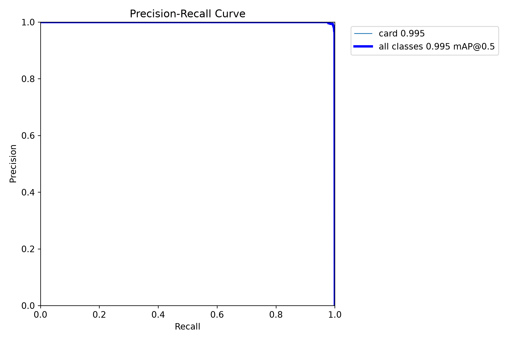
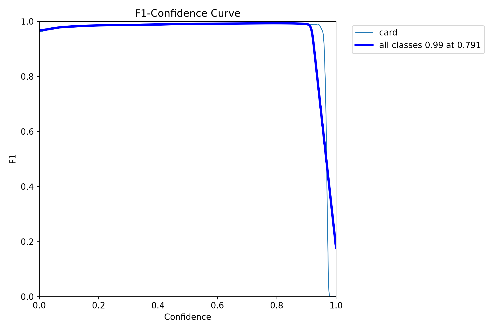
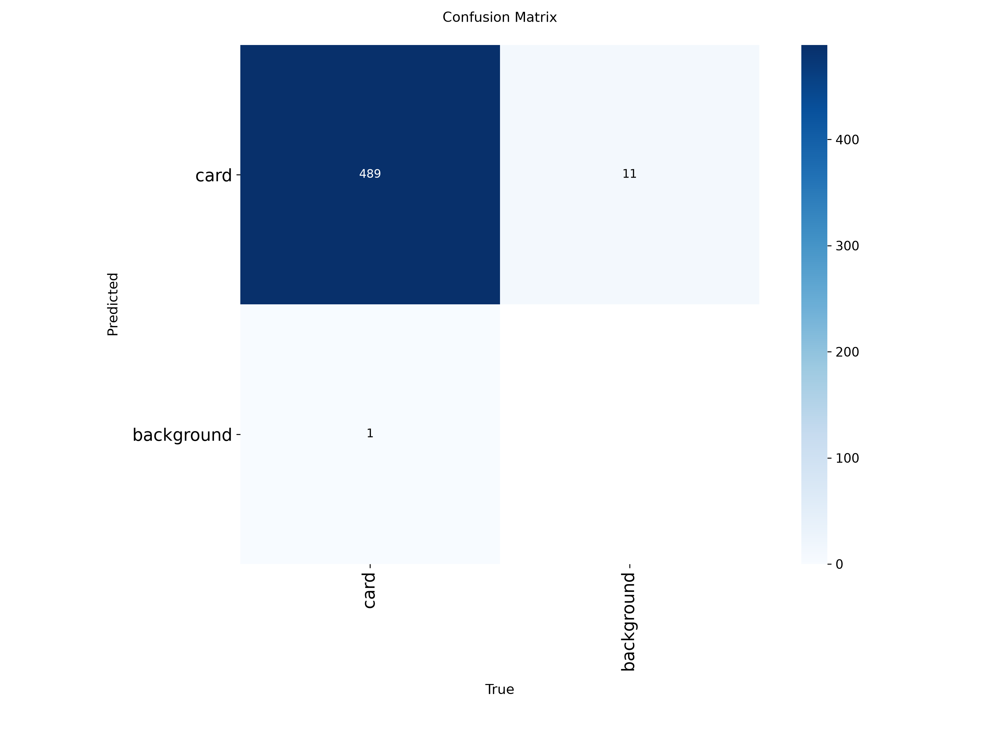
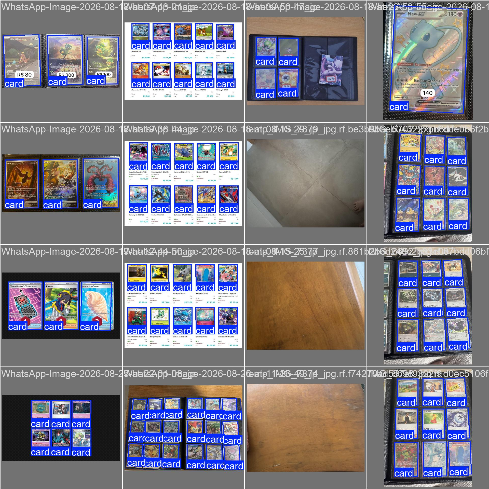

# TCG Trade — Detecção de Cartas com YOLOv8 OBB

Pipeline de **detecção** (pasta `OBB/` do repositório). Localiza cada carta e estima a rotação da caixa.

Ele responde: *“existe uma carta aqui, nesta posição e neste ângulo?”*  
Ele **não** faz segmentação e **não** reconhece o nome do Pokémon. Recorte retificado: pasta [`CROPPER/`](../CROPPER/).

O treino está em [`train_yolov8_obb.ipynb`](train_yolov8_obb.ipynb). Rode o notebook com o cwd na raiz do repo ou nesta pasta — `ROOT` aponta sozinho para `OBB/`.

Comparações: [`docs/comparison-obb-v2-v3/README.md`](docs/comparison-obb-v2-v3/README.md) (atual) · [`docs/comparison-obb-v1-v2/README.md`](docs/comparison-obb-v1-v2/README.md) (histórico, dataset stretch).

## Dataset (local, fora do Git)

Anotações YOLO OBB: `class x1 y1 x2 y2 x3 y3 x4 y4`, projeto [Pokemon TCC](https://universe.roboflow.com/pokemon-tcc/pokemon-tcc) **v8**.

A pasta `dataset/` **não entra no Git**. Exporte **YOLOv8 OBB** do Roboflow para `OBB/dataset/` (`data.yaml`, `train/`, `valid/`, `test/`).

| Split | Imagens | Labels vazios (negativos) | Instâncias `card` |
|---|---|---|---|
| Treino | 245 | 19 | 1680 |
| Validação | 75 | 8 | 490 |
| Teste | 36 | 4 | 255 |
| **Total** | **356** | **31** | **2425** |

Pré-processamento: só auto-orientação EXIF. **Sem resize/stretch** e sem augmentation no export.

| Item | Recomendação |
|---|---|
| Auto-orient (EXIF) | Ligado |
| Resize | **Nenhum**. Se as fotos forem 4K, **Fit/Letterbox** no lado longo (ex. 1920), nunca Stretch |
| Augmentation no export | **Nenhuma** |
| Anotação | 4 cantos no **limite físico da carta** (borda impressa), não o plástico do binder. Sem isso o OCR herda bolso/vizinha. |

## Como treinar (`obb-v4`)

No notebook, `VERSION = "v4"`. **Fine-tune** a partir de `obb-v3.pt` (não recomeça do `yolov8n`). Objetivo: caixa mais colada na **borda impressa**.

Antes de treinar, no Roboflow: os 4 cantos no **retângulo impresso da carta**, não no plástico do binder. Se a anotação inclui o bolso, o modelo aprende bolso.

| Item | v3 | **v4 (bordas)** |
|---|---|---|
| Checkpoint inicial | `yolov8n-obb.pt` | **`obb-v3.pt`** |
| `imgsz` | 800 | **960** (OOM → 800 ou `batch=4`) |
| Mosaic / erasing | 1,0 / 0,10 | **0 / 0** |
| Box / DFL / angle | 10 / 2,0 / 1,5 | **12 / 2,5 / 2,0** |
| Rotação / scale / translate | 30° / 0,4 / 0,10 | **15° / 0,3 / 0,05** |
| Optimizer / LR | auto / 0,01 | **AdamW / 0,001** |
| Épocas | 120 (parou em 99) | **80** (patience 20) |

Rode as células na ordem. Pesos: `runs/obb/obb-v4/weights/obb-v4.pt`. Depois aponte o CROPPER para esse arquivo (`--weights`).

```powershell
python -m venv .venv
.\.venv\Scripts\python.exe -m pip install --upgrade pip
.\.venv\Scripts\python.exe -m pip install torch torchvision --index-url https://download.pytorch.org/whl/cu128
.\.venv\Scripts\python.exe -m pip install -r requirements.txt
```

## Resultados do experimento `obb-v3`

Validação: **75 imagens / 490 cartas** (8 negativas). Teste: **36 imagens / 255 cartas** (4 negativas). Treino: 99 épocas (~27 min na RTX 5060), `imgsz=800`.

| Métrica | Validação | Teste | O que significa |
|---|---|---|---|
| **Recall** | 0.994 | **1.000** | Quase todas / todas as cartas anotadas foram encontradas. |
| **Precision** | 0.994 | 0.996 | Quase todas as caixas previstas eram carta de verdade. |
| **mAP@0.50** | 0.995 | 0.995 | A caixa orientada cobre a carta com IoU ≥ 50%. |
| **mAP@0.75** | 0.995 | 0.995 | Continua alto com encaixe mais apertado. |
| **mAP@0.50:0.95** | **0.994** | **0.994** | Localização + orientação (borda). Era 0.983 no v2 / ~0.93 quando o v2 é testado neste dataset nativo. |

Perdas na última época: box 0.185 / cls 0.123 / DFL 1.132 / angle 0.002. Angle ~0 = rotação colada.

Matriz do treino (val): **TP 489, FP 11, FN 1**. F1 da curva pico em conf **0,79** — no app, `conf=0.8` continua o limiar certo.

Na RTX 5060: ~4,4 ms de inferência + ~3,9 ms de pós-processamento por imagem (800 px).


### Precision–Recall e F1

A curva PR no canto superior direito (mAP50 = 0.995). A F1 cai só depois de ~0,92 de confidence — não suba o `conf` para 0,9.





### Matriz de confusão — como ler (importante)

O YOLO **não** classifica cada pixel como carta/fundo. Ele **casa caixas**:

|  | Verdade: carta | Verdade: fundo |
|---|---|---|
| Predito: carta | acerto (TP) — no v3: **489** | falso positivo (FP) — no v3: **11** |
| Predito: fundo | miss (FN) — no v3: **1** | **sempre 0** |

**Por que fundo→fundo é 0?** Não existem objetos “fundo” anotados. Fundo só aparece como *balde* de erros: predição sem carta (FP) ou carta sem predição (FN).

**Por que a normalizada parece modelo ruim?** Ela divide **cada coluna** pela soma da coluna. A coluna de fundo só tem os FPs, então FP/FP = **1.00**. Isso não significa que 100% da imagem foi classificada como carta.

Use a matriz de **contagens** + mAP. A normalizada, sozinha, engana.




### Labels vs predições

Esquerda: anotações. Direita: o que o modelo desenhou. Conferir se as caixas colam na borda da carta.




## Inferência

Use `obb-v4.pt` e `imgsz=960` depois do treino v4. Até lá, o CROPPER cai no v3 (`imgsz=800`).

```python
from ultralytics import YOLO

model = YOLO("OBB/runs/obb/obb-v4/weights/obb-v4.pt")  # ou obb-v3 enquanto o v4 não existir
results = model.predict("OBB/dataset/test/images", conf=0.8, imgsz=960, save=True)
```

## Estrutura

```
OBB/
  dataset/                        # local (gitignore) — export Roboflow YOLO OBB
  docs/figures/                   # gráficos do obb-v3
  docs/comparison-obb-v1-v2/
  docs/comparison-obb-v2-v3/
  train_yolov8_obb.ipynb
  runs/obb/                       # treinos locais (não versionado)
```

`.venv/`, `OBB/dataset/`, `OBB/runs/` e pesos `.pt`/`.onnx` ficam fora do Git.
