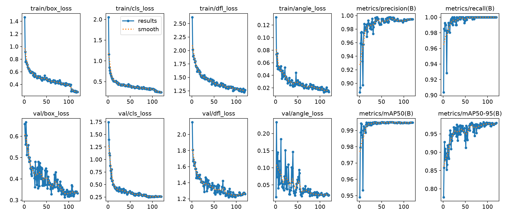
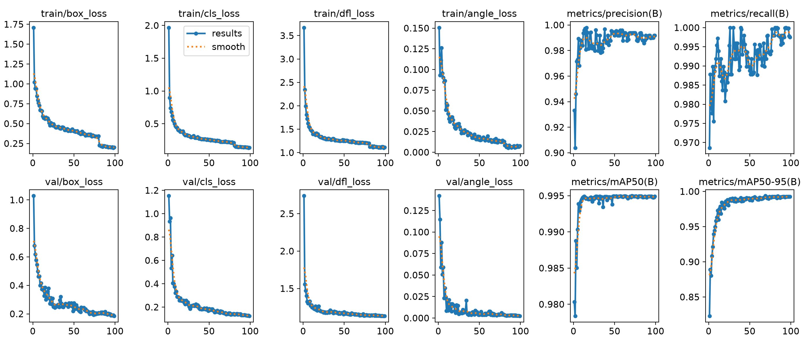
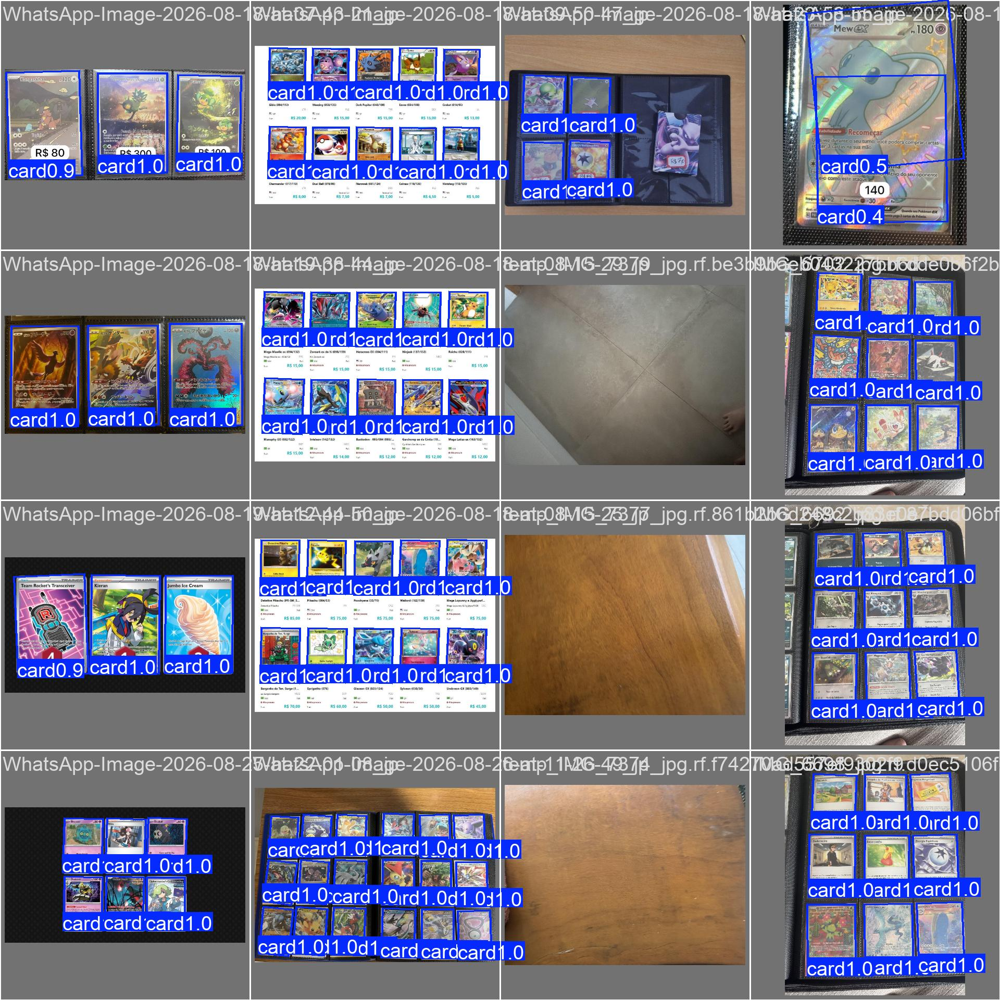

# Comparação `obb-v2` vs `obb-v3`

Relatório dos dois treinos. O modelo do README principal é o **obb-v3**.

Gráficos: [`figures/v2/`](figures/v2/) e [`figures/v3/`](figures/v3/).  
Comparação anterior (dataset stretch): [`../comparison-obb-v1-v2/README.md`](../comparison-obb-v1-v2/README.md).

O objetivo do v3 era **borda mais justa** (mAP50-95 / DFL / ângulo), não achar mais cartas. O v2 já tinha recall ~1 no dataset antigo.

## O que mudou

| | **obb-v2** | **obb-v3** |
|---|---|---|
| Dataset Roboflow | v6 (284 imagens, stretch 512) | **v8 (356 imagens, sem resize)** |
| Treino / val / teste | 196 / 59 / 29 | **245 / 75 / 36** |
| Instâncias `card` | 1459 / 405 / 204 | **1680 / 490 / 255** |
| Negativos | 19 + 8 + 4 | 19 + 8 + 4 |
| Pré-processamento | stretch 512×512 | **só auto-orient EXIF** |
| `imgsz` | 640 | **800** |
| Box / DFL / angle | 7,5 / 1,5 / 1,0 | **10 / 2,0 / 1,5** |
| Rotação / scale / shear | 45° / 0,6 / 5 | **30° / 0,4 / 0** |
| Mixup | 0,05 | **0** |
| Mosaic desliga | últimas 15 épocas | **últimas 40** |
| Épocas corridas | 120 / 120 | **99 / 120** (early stop, patience 30) |
| Tempo (RTX 5060) | ~11 min | ~27 min |
| Pesos | `runs/obb/obb-v2/weights/obb-v2.pt` | `runs/obb/obb-v3/weights/obb-v3.pt` |

Dois tipos de número:

1. **Val do próprio treino** — cada modelo no val da época (conjuntos diferentes: stretch vs nativo).
2. **Head-to-head** — os dois checkpoints no dataset **atual** (Roboflow v8, sem stretch).

## 1. Métricas do próprio treino

Não comparar mAP 1:1: o val do v3 tem mais cartas e geometria nativa.

| Métrica | v2 (val v6 stretch, 59 imgs / 405 cartas) | v3 (val v8 nativo, 75 imgs / 490 cartas) |
|---|---|---|
| Precision | 0.992 | **0.994** |
| Recall | **1.000** | 0.994 |
| mAP@0.50 | 0.995 | 0.995 |
| mAP@0.75 | 0.995 | **0.995** |
| **mAP@0.50:0.95** | 0.983 | **0.994** |
| Matriz TP / FP / FN | 405 / 13 / 0 | **489 / 11 / 1** |
| Val box / cls / DFL / angle | 0.332 / 0.260 / 1.260 / 0.020 | **0.185 / 0.123 / 1.132 / 0.002** |
| Melhor época (mAP50-95 no CSV) | 91 (0.982) | 69 (0.994) |
| F1 ótimo (curva) | 1,00 @ 0,842 | 0,99 @ **0,791** |

O salto que importa para borda é o **mAP50-95** (0.983 → 0.994) e as perdas de box/ângulo. Um miss no val (FN=1) no meio de 490 cartas é aceitável; os FPs absolutos caíram (13 → 11) com mais instâncias.

### Curvas

**v2 (120 épocas, mosaic até a 105)**

**v3 (99 épocas, mosaic até a 80; early stop)**

No v3 o degrau perto da época 80 é o `close_mosaic`. O `best.pt` ficou na época 69 (ainda com mosaic); a última época (99) tem mAP50-95 quase igual (0.993 vs 0.994).

### Matriz de confusão (contagens)

**v2** — TP 405, FP 13, FN 0

**v3** — TP 489, FP 11, FN 1

Fundo→fundo continua 0. Use a matriz de contagens, não a normalizada.

### Predições no val

**v2**

**v3**

## 2. Head-to-head no dataset atual (v8, sem stretch)

Mesmo `dataset/data.yaml`. Cada modelo no `imgsz` em que foi treinado (640 vs 800). O v2 **não** viu este export nativo.

**Validação — 75 imagens, 490 cartas, 8 vazias**

| | Precision | Recall | mAP50 | mAP75 | **mAP50-95** |
|---|---|---|---|---|---|
| obb-v2 @640 | 0.976 | 0.955 | 0.984 | 0.967 | 0.934 |
| obb-v3 @800 | **0.994** | **0.994** | **0.995** | **0.995** | **0.994** |

**Teste — 36 imagens, 255 cartas, 4 vazias**

| | Precision | Recall | mAP50 | mAP75 | **mAP50-95** |
|---|---|---|---|---|---|
| obb-v2 @640 | 0.984 | 0.952 | 0.990 | 0.978 | 0.938 |
| obb-v3 @800 | **0.996** | **1.000** | **0.995** | **0.995** | **0.994** |

O v2 “piora” neste conjunto porque treinou em carta **esticada a 512 px**. Não é regressão do v2 no dataset antigo; é o v2 desalinhado da geometria real. O mAP50-95 0.934 vs 0.994 é exatamente a folga na borda.

Velocidade na RTX 5060 (val): v2 ~3,7 ms inferência; v3 ~4,4 ms @800. Irrelevante para escolher o checkpoint.

## Conclusão

**Usar o obb-v3.**

- Borda: mAP50-95 sobe de ~0,98 (val antigo do v2) / ~0,93 (v2 no dataset novo) para **0,994**.
- Teste atual: recall 1,0 e precision 0,996.
- Inferência no app: `conf=0.8` continua adequado (F1 pico em 0,79).

O ganho veio sobretudo de **tirar o stretch + `imgsz=800`**, com o empurrão extra de box/DFL e mosaic mais curto no fim. Não volta para o v2 neste dataset.
