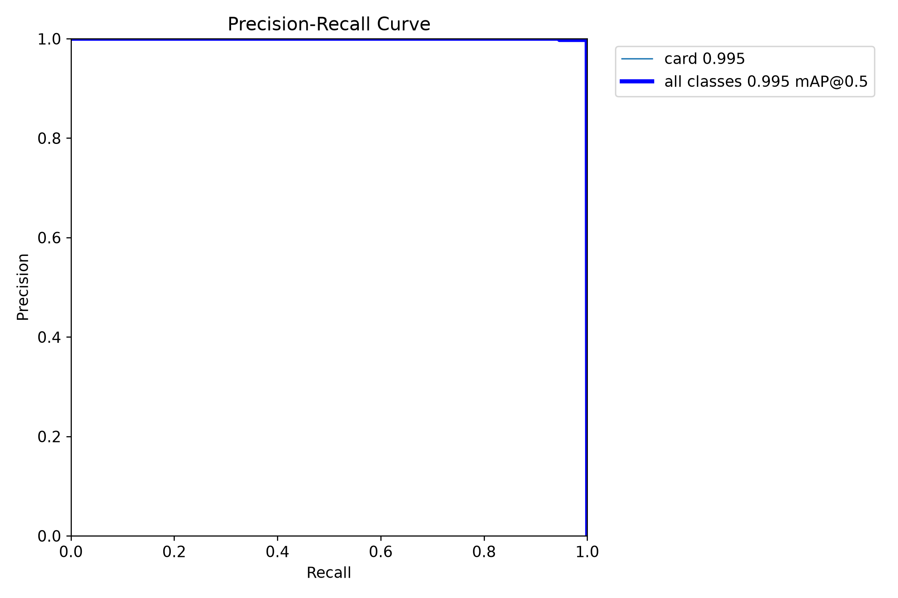
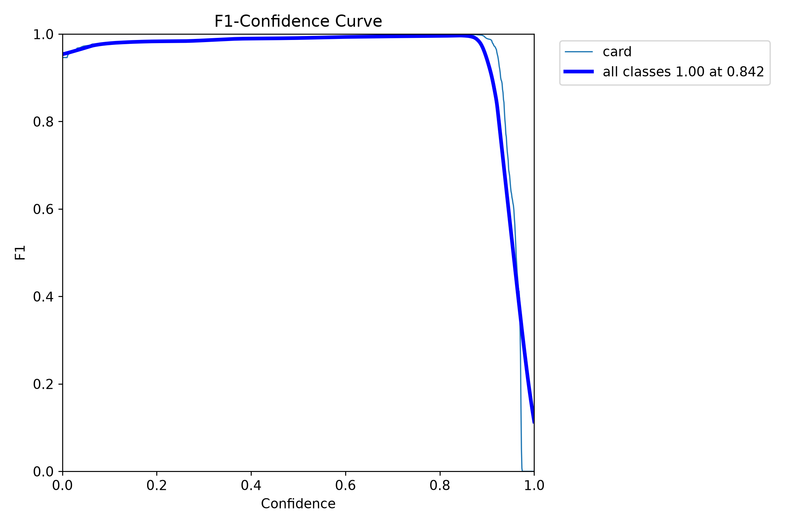
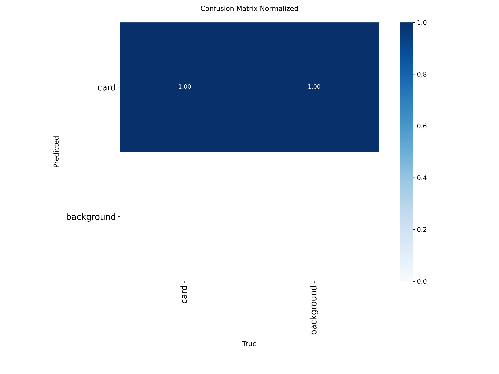
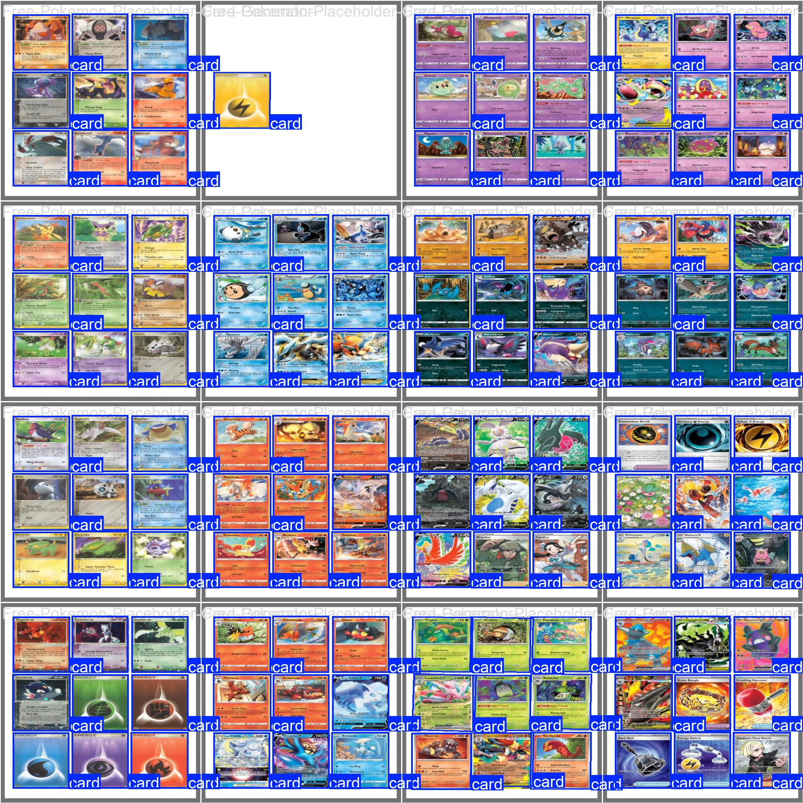

# TCG Trade — Detecção de Cartas com YOLOv8 OBB

Este projeto treina um **detector** de cartas de TCG (Pokémon) com **YOLOv8 Oriented Bounding Boxes (OBB)**.

Ele responde: *“existe uma carta aqui, nesta posição e neste ângulo?”*  
Ele **não** faz segmentação (máscara por pixel) e **não** reconhece o nome do Pokémon. A única classe é `card`.

O pipeline (validação do dataset, treino, métricas, gráficos e exportação ONNX) está em [`train_yolov8_obb.ipynb`](train_yolov8_obb.ipynb).

Comparação detalhada entre experimentos: [`docs/comparison-obb-v1-v2/README.md`](docs/comparison-obb-v1-v2/README.md).

## Dataset (Roboflow v6)

Anotações YOLO OBB: `class x1 y1 x2 y2 x3 y3 x4 y4`, projeto [Pokemon TCC](https://universe.roboflow.com/pokemon-tcc/pokemon-tcc).

| Split | Imagens | Labels vazios (negativos) | Instâncias `card` |
|---|---|---|---|
| Treino | 196 | 19 | 1459 |
| Validação | 59 | 8 | 405 |
| Teste | 29 | 4 | 204 |
| **Total** | **284** | **31** | **2068** |

- Imagens **negativas** = foto sem carta, com arquivo `.txt` vazio. Ensinam o modelo a não inventar box no fundo.
- Pré-processamento no Roboflow: auto-orientação EXIF e resize 512×512 (stretch).
- Augmentation no Roboflow: nenhuma (a rotação/brilho entra no treino Ultralytics).

## Como treinar (`obb-v2`)

No notebook, `VERSION = "v2"`. Checkpoint: `yolov8n-obb.pt`.

| Item | Valor |
|---|---|
| Arquitetura | YOLOv8n-OBB |
| Épocas | 120 (early stopping patience 30) |
| Imagem | 640 px |
| Batch | 16 |
| LR | cosine (`cos_lr=True`) |
| Rotação | `degrees=45` (cartas inclinadas na mesa) |
| Flip | horizontal e vertical 0,5 |
| Mosaic | até as últimas 15 épocas |
| Mixup | 0,05 |
| Random erase | 0,15 (mais baixo que o padrão, para não apagar a carta) |
| Hardware | RTX 5060, PyTorch 2.11+cu128 |

Rode as células do notebook na ordem. Os pesos saem em `runs/obb/obb-v2/weights/obb-v2.pt` e `.onnx`.

```powershell
python -m venv .venv
.\.venv\Scripts\python.exe -m pip install --upgrade pip
.\.venv\Scripts\python.exe -m pip install torch torchvision --index-url https://download.pytorch.org/whl/cu128
.\.venv\Scripts\python.exe -m pip install -r requirements.txt
```

## Resultados do experimento `obb-v2`

Validação em **59 imagens / 405 cartas** (8 fotos sem carta). Teste em **29 imagens / 204 cartas** (4 negativas). Treino: 120 épocas, ~11 min na RTX 5060.

| Métrica | Validação | Teste | O que significa |
|---|---|---|---|
| **Recall** | **1.000** | **1.000** | Todas as cartas anotadas foram encontradas (nenhum miss). |
| **Precision** | 0.992 | 0.992 | Quase todas as caixas previstas eram carta de verdade. |
| **mAP@0.50** | 0.995 | 0.994 | A caixa orientada cobre bem a carta com IoU ≥ 50%. |
| **mAP@0.75** | 0.995 | 0.994 | Continua alto mesmo exigindo encaixe mais apertado. |
| **mAP@0.50:0.95** | 0.983 | 0.978 | Média em vários IoUs — melhor resumo de **localização + orientação**. |

Na última época de treino, perdas de validação: box 0.332 / cls 0.260 / DFL 1.260 / angle 0.020. Angle baixo = rotação boa.

Na RTX 5060: ~2,0 ms de inferência + ~2,6 ms de pós-processamento por imagem (640×640).

Matriz de confusão do treino (contagens no val): **TP 405, FP 13, FN 0**. Os 13 falsos positivos são o ponto que ainda dá para melhorar — o modelo não perde carta, mas às vezes desenha box no fundo.

Curvas ao longo das 120 épocas (treino em azul, média suave em laranja). Precision, Recall e mAP sobem cedo e estabilizam perto de 1; o degrau nas perdas no fim é o `close_mosaic`.


### Precision–Recall e F1

A curva PR quase no canto superior direito (mAP50 = 0.995): o modelo mantém precisão alta mesmo com recall alto. A F1 mostra o melhor limiar de confidence — acima disso você corta falsos positivos; abaixo, começa a perder carta.





### Matriz de confusão — como ler (importante)

O YOLO **não** classifica cada pixel como carta/fundo. Ele **casa caixas**:

|  | Verdade: carta | Verdade: fundo |
|---|---|---|
| Predito: carta | acerto (TP) — no v2: **405** | falso positivo (FP) — no v2: **13** |
| Predito: fundo | miss (FN) — no v2: **0** | **sempre 0** |

**Por que fundo→fundo é 0?** Não existem objetos “fundo” anotados. Essa célula não conta “acertos de carpete”. Fundo só aparece como *balde* de erros: predição sem carta (FP) ou carta sem predição (FN).

**Por que a normalizada parece modelo ruim?** Ela divide **cada coluna** pela soma da coluna. A coluna de fundo só tem os 13 FPs, então 13/13 = **1.00** (azul escuro em fundo→carta). Isso *não* quer dizer que 100% da imagem foi classificada como carta. Quer dizer: “dos erros de fundo que existiram, todos foram ‘previu carta’” — o único tipo de FP possível com 1 classe.

Use a matriz de **contagens** + mAP. A normalizada, sozinha, engana.




### Labels vs predições

Esquerda: anotações. Direita: o que o modelo desenhou. Conferir se as caixas giram junto com a carta e se aparece box extra no fundo (os FPs).




## Inferência

```python
from ultralytics import YOLO

model = YOLO("runs/obb/obb-v2/weights/obb-v2.pt")
results = model.predict("dataset/test/images", save=True)
```

## Estrutura

```
dataset/                          # imagens + labels OBB + data.yaml (v6)
docs/figures/                     # gráficos do obb-v2 (versionados)
docs/comparison-obb-v1-v2/        # relatório v1 vs v2
train_yolov8_obb.ipynb
requirements.txt
runs/obb/                         # treinos locais (não versionado)
```

`.venv/`, `runs/` e pesos `.pt`/`.onnx` ficam fora do Git.
