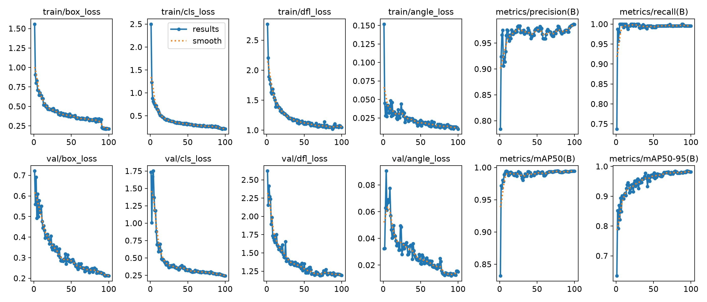
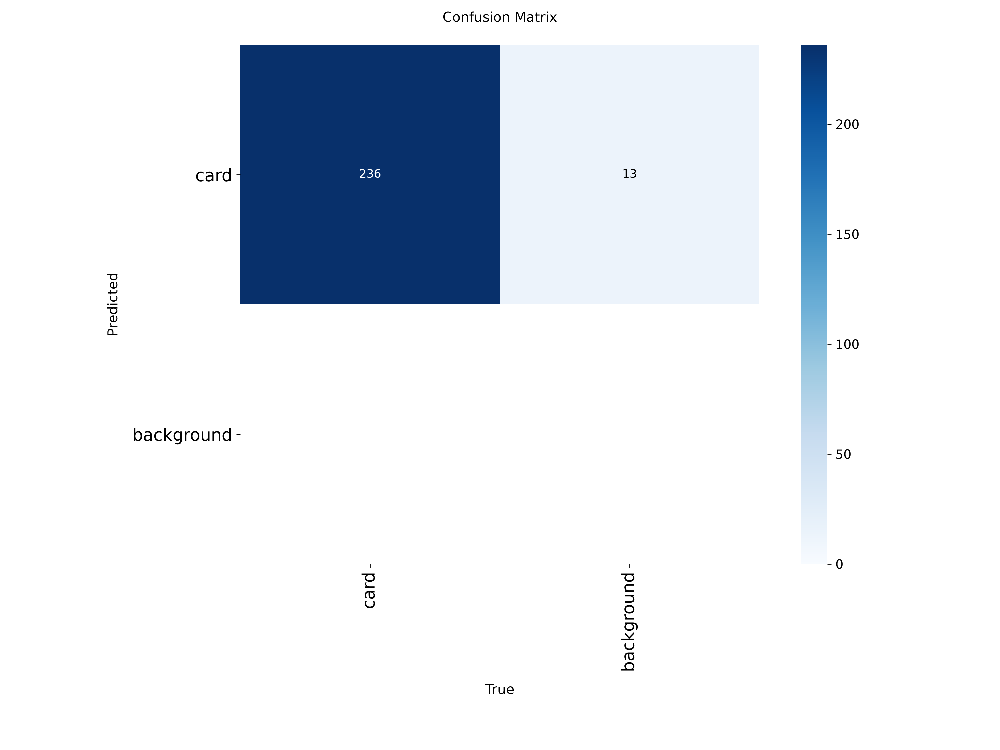
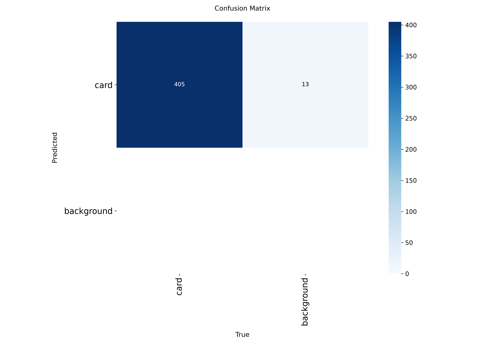
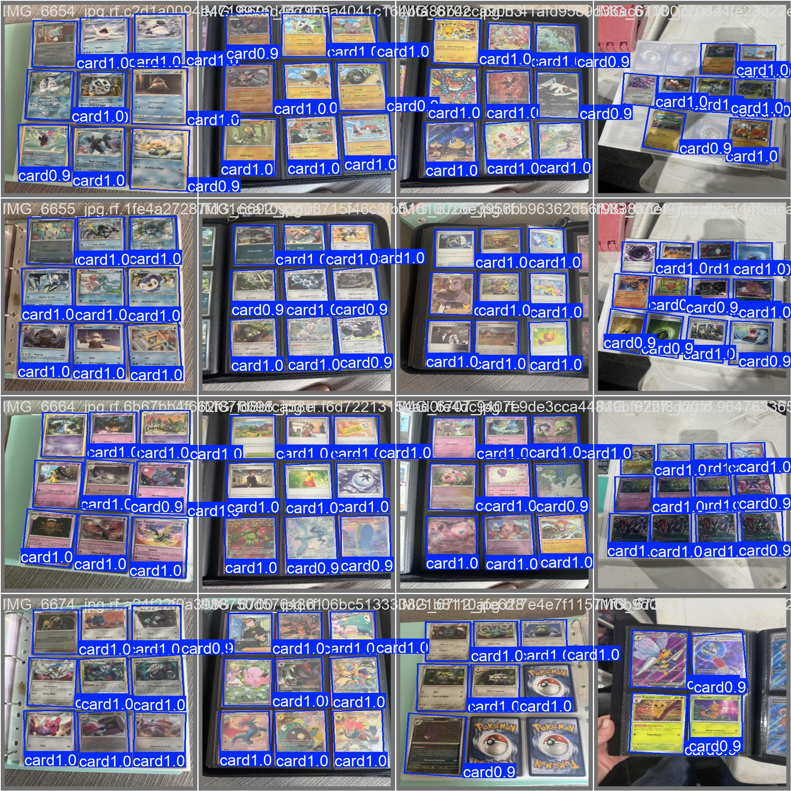
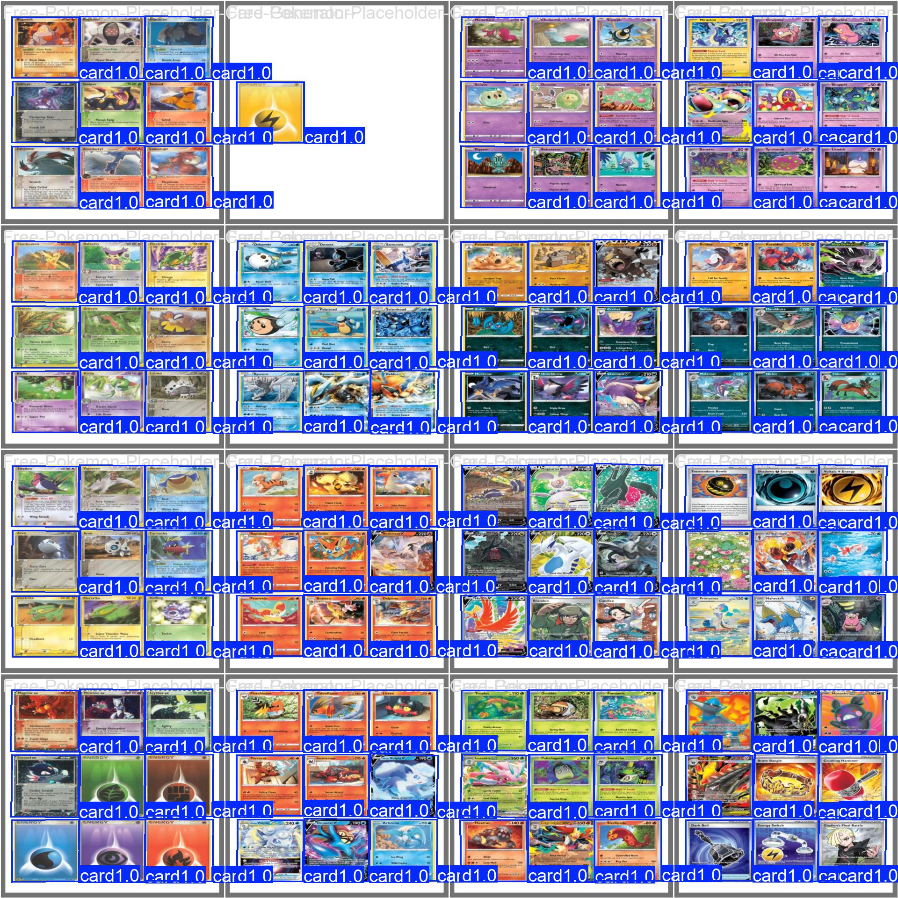

# Comparação `obb-v1` vs `obb-v2`

Relatório dos dois treinos YOLOv8-OBB neste repositório. O modelo em produção / README principal é o **obb-v2**.

Gráficos originais de cada run: [`figures/v1/`](figures/v1/) e [`figures/v2/`](figures/v2/).

## O que mudou

| | **obb-v1** | **obb-v2** |
|---|---|---|
| Dataset Roboflow | v5 (~156 imagens) | v6 (**284** imagens) |
| Treino / val / teste | 110 / 31 / 15 | **196 / 59 / 29** |
| Instâncias `card` no val | 236 | **405** |
| Imagens negativas (`.txt` vazio) | quase nenhuma | 19 treino + 8 val + 4 teste |
| Arquitetura | YOLOv8n-OBB | YOLOv8n-OBB (igual) |
| Épocas / patience | 100 / 20 | **120 / 30** |
| LR | linear | **cosine** |
| Rotação (`degrees`) | 0 | **45** |
| Flip vertical | 0 | **0,5** |
| Translate / scale / shear | 0,1 / 0,5 / 0 | 0,15 / 0,6 / **5** |
| HSV (h / s / v) | 0,015 / 0,7 / 0,4 | 0,02 / 0,8 / 0,5 |
| Mosaic até | últimas 10 épocas | últimas **15** |
| Mixup | 0 | **0,05** |
| Random erase | 0,4 | **0,15** |
| Tempo de treino (RTX 5060) | ~5 min | ~11 min |
| Pesos | `runs/obb/obb-v1/weights/obb-v1.pt` | `runs/obb/obb-v2/weights/obb-v2.pt` |

Dois tipos de número abaixo:

1. **Val do próprio treino** — cada modelo no split de validação da época em que foi treinado (conjuntos *diferentes*).
2. **Head-to-head** — os dois checkpoints reavaliados no dataset **atual** (Roboflow v6), val e teste.

## 1. Métricas do próprio treino

Não comparar mAP 1:1: o val do v2 tem quase o dobro de cartas **e** fotos sem carta.

| Métrica | v1 (val v5, 31 imgs / 236 cartas) | v2 (val v6, 59 imgs / 405 cartas) |
|---|---|---|
| Precision | 0.983 | **0.992** (`model.val()`) / 0.995 última época |
| Recall | 0.996 | **1.000** |
| mAP@0.50 | 0.994 | **0.995** |
| mAP@0.75 | 0.994 | **0.995** |
| mAP@0.50:0.95 | **0.985** | 0.983 |
| Matriz TP / FP / FN | 236 / 13 / 0 | **405 / 13 / 0** |
| Val box / cls / DFL / angle (última época) | 0.212 / 0.243 / 1.194 / 0.015 | 0.332 / 0.260 / 1.260 / 0.020 |
| Melhor época (mAP50-95 no CSV) | 95 (0.985) | 91 (0.982) |

Os **13 FPs absolutos se mantiveram**, com quase o dobro de instâncias. A taxa de alarme falso caiu. Perdas de box/angle mais altas no v2 refletem val mais difícil (mais poses, mosaic, negativos), não regressão óbvia.

### Curvas

**v1 (100 épocas)**

**v2 (120 épocas)**

Nos dois, precision/recall e mAP sobem cedo (~20 épocas) e estabilizam perto de 1. No v2 o degrau final de loss é o `close_mosaic` (~época 105).

### Matriz de confusão (contagens)

**v1** — TP 236, FP 13, FN 0

**v2** — TP 405, FP 13, FN 0

Fundo→fundo é sempre 0 (não existem objetos “fundo”). A matriz **normalizada** pinta a coluna de fundo de azul escuro (13/13 = 1,00) e engana; use a de contagens.

### Predições no val

**v1**

**v2**

## 2. Head-to-head no dataset atual (v6)

Mesmo `dataset/data.yaml`, mesmos splits de hoje. O v1 **não** foi treinado neste conjunto maior; o v2 sim.

**Validação — 59 imagens, 405 cartas, 8 vazias**

| | Precision | Recall | mAP50 | mAP75 | mAP50-95 |
|---|---|---|---|---|---|
| obb-v1 | 0.983 | 0.995 | 0.994 | 0.994 | **0.983** |
| obb-v2 | **0.992** | **1.000** | **0.995** | **0.995** | 0.983 |

**Teste — 29 imagens, 204 cartas, 4 vazias** (o treino não usa este split)

| | Precision | Recall | mAP50 | mAP50-95 |
|---|---|---|---|---|
| obb-v1 | 0.990 | 0.994 | 0.994 | **0.987** |
| obb-v2 | **0.992** | **1.000** | 0.994 | 0.978 |

Velocidade na RTX 5060 (val, 640 px): v1 ~2,6 ms inferência + 3,9 ms pós; v2 ~2,0 ms + 2,6 ms. Irrelevante para escolher o checkpoint.

## Conclusão

**Usar o obb-v2.**

- Recall perfeito no val e no teste atuais: não perde carta.
- Precision melhor: menos box inventada, na média.
- Treinou com mais fotos reais, páginas densas e **negativos**.
- O mAP50-95 do v1 no teste (0.987 vs 0.978) é um fio à frente na *apertada* da caixa, mas o teste tem só 29 imagens — diferença dentro do ruído. Não justifica voltar ao v1.

O ganho do dataset aumentado **não aparece como salto de mAP** porque o v1 já estava no teto (~0,98–0,99). Aparece em **não missar carta**, **menos FP relativo** e **dados mais parecidos com o uso real**.
